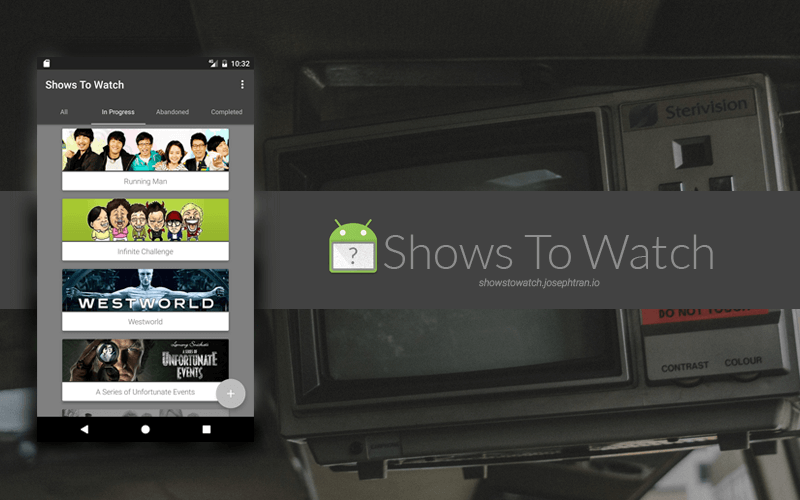
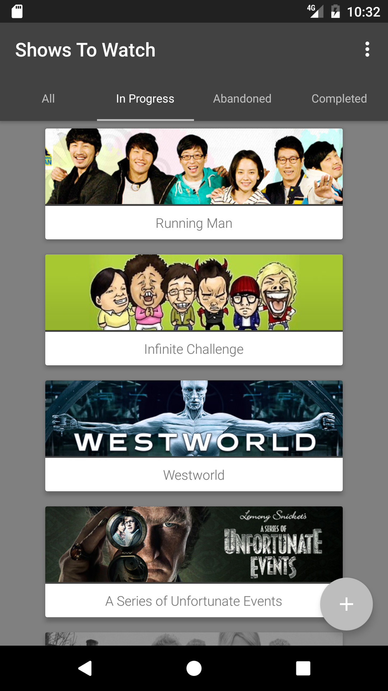
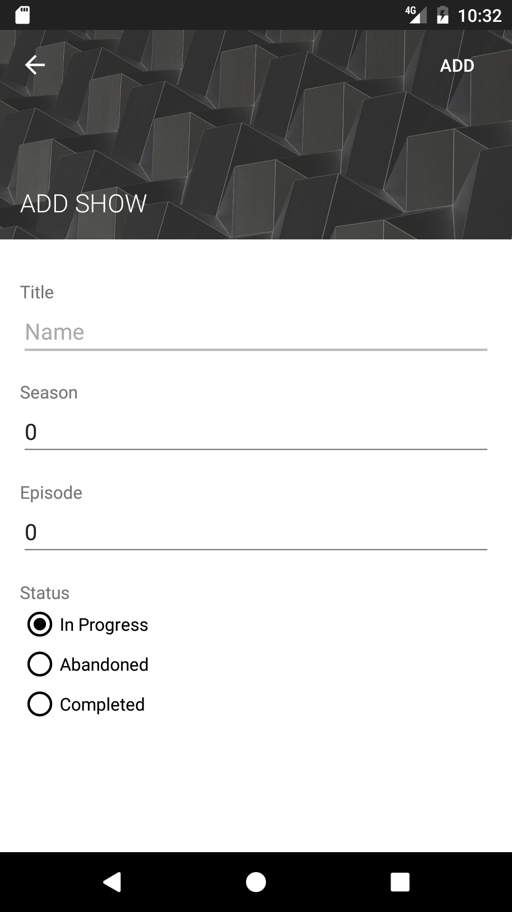

  
# Shows To Watch Android Application
Interact with the <a href="http://showstowatch.josephtran.io"> Shows to Watch</a> site using an android application.

## Installation
Install the following apk:  
<a href="https://github.com/JotraN/shows-to-watch-android/raw/master/showstowatch.apk">showstowatch.apk</a> 
> 1. Copy the apk to your phone.
> 2. Make sure installing from 'Unknown sources' is enabled.
> 3. Open and install the apk on your phone.

You can also install this application by building it yourself in Android Studio:  
> 1. File -> Open...
> 2. Run -> Run 'app'

## Notable Libraries Used
<a href="https://github.com/ReactiveX/RxJava">RxJava (1.1.6)</a> 
<a href="https://github.com/ReactiveX/RxAndroid">RxAndroid (1.2.1)</a> 
<a href="https://github.com/square/retrofit">Retrofit (2.1.0)</a> 
<a href="https://github.com/square/okhttp">OkHttp (3.3.1)</a> 
<a href="https://github.com/square/picasso">Picasso (2.5.2)</a> 
<a href="https://github.com/mockito/mockito">Mockito (2.3.9)</a> 

## License
This project is licensed under the terms of the MIT license.